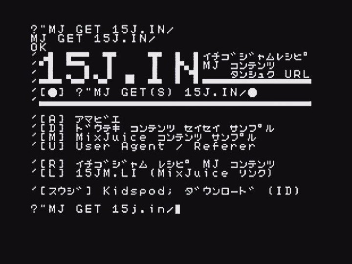

## イチゴジャム レシピ MixJuice コンテンツ 短縮 URL



[MixJuice コンテンツ 15j.run](https://github.com/fu-sen/15j.run) から\
[ふうせん🎈 Fu-sen.](https://balloon.im/) が公開している関連の MixJuice コンテンツの\
短縮 URL を `15j.in` へ分離しました。
IchigoJam BASIC＋MixJuice で使用できる MixJuice 専門の短縮 URL です。

次のコマンドで参照できます。GET の代わりに GETS も使用可能です。\
GETS は MixJuice 1.2.2 以降で参照可能です。IchigoJam web では GETS を使用して下さい。

```
?"MJ GET 15J.IN/
```

`15J.IN/英 1 文字` の短縮 URL を用意し、素早く参照できるようにしています。

```
?"MJ GET 15J.IN/●
```

対応している MixJuice コンテンツ は次のとおりです。

|アドレス|内容|
|--------|----|
|15J.IN/ |短縮 URL メニュー|
|15J.IN/A|[アマビエ](https://15jamrecipe.jimdofree.com/basic/%E3%83%97%E3%83%AD%E3%82%B0%E3%83%A9%E3%83%A0/%E3%82%A2%E3%83%9E%E3%83%93%E3%82%A8/)|
|15J.IN/D|[MixJuice 向けコンテンツの作成と公開 - 動的コンテンツ生成 サンプル](http://kidspod.club/program/?id=685)|
|15J.IN/M|[MixJuice コンテンツ サンプル](https://github.com/fu-sen/mj.15j.run)|
|15J.IN/U|[MixJuice 向けコンテンツの作成と公開 - User Agent](https://15jamrecipe.jimdofree.com/mixjuice/%E3%82%B3%E3%83%B3%E3%83%86%E3%83%B3%E3%83%84%E3%81%AE%E4%BD%9C%E6%88%90%E3%81%A8%E5%85%AC%E9%96%8B/#ua)|

他の人が作成した MixJuice コンテンツの短縮 URL は [15jm.li](https://github.com/fu-sen/15jm.li) で提供しています。

## MixJuice コンテンツ製作 について

[MixJuice 向けコンテンツの作成と公開 | イチゴジャム レシピ](https://15jamrecipe.jimdofree.com/mixjuice/%E3%82%B3%E3%83%B3%E3%83%86%E3%83%B3%E3%83%84%E3%81%AE%E4%BD%9C%E6%88%90%E3%81%A8%E5%85%AC%E9%96%8B/)

## 関連 Web サイト

IchigoJam https://ichigojam.net/ \
MixJuice http://mixjuice.shizentai.jp/

イチゴジャム レシピ https://15jamrecipe.jimdofree.com/

## Powered by

さくらのレンタルサーバ https://www.sakura.ne.jp/
